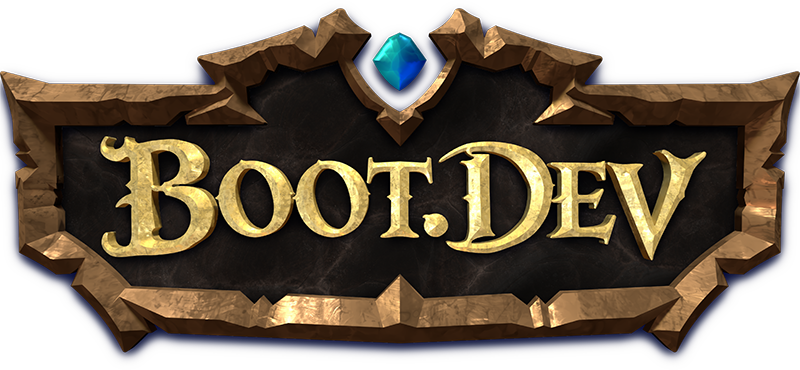
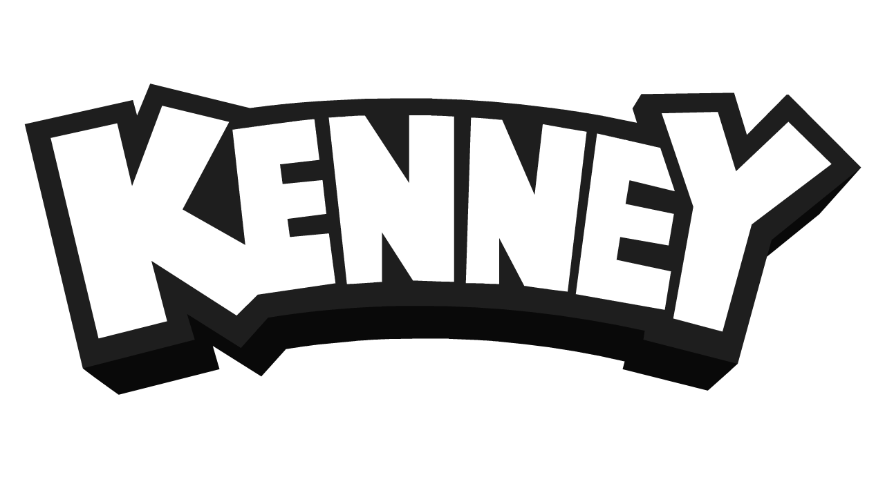
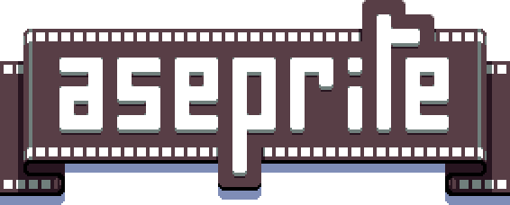

# Hey, Welcome to the home of Stop Killing Games Community Jam!

This jam is created by the community surrounding the Stop Killing Games movement.
By ordinary people who love the medium and care for it's preservation. 

<a class="jam-cta" href="https://itch.io/jam/skg-jam-2026">Stop Killing Games Community Jam 2026</a>

The unique part of our jam is the care for the end-of-life planning for your game.
You have to not only develop the game, but also think about the preservation of your game.
Will the players be able to enjoy it if itch.io goes down? 
What if you decide to unpublish it - will the player be able to keep playing?
After all, we are making the games for the players!

## 2026 Edition

Current edition of the jam is SKG Community Jam 2026.
It will be held from July 17 to July 31, 2026.
There is plenty of time to get ready, so go ahead and sign up!

## This time there are some prizes involved!

    
     

Thanks to the wonderful people at Boot.dev, every member of the winning team will get a 1-year membership to their platform!
Additionally, everyone who submits a valid game jam entry will get a 1-month Boot.dev membership :)
Thanks to Boot.dev for supporting our jam!

---

    
     

Kenney.nl, the creator of the fantastic free graphic assets many of us use in our games has supported our jam with prizes for our winning teams!

Each of the top 3 teams will get:

- 3× Asset Forge Deluxe
- 3× Kenney Game Assets All-in-1

Thank you very much, Kenney for those wonderful prizes!

--- 

    
     

Igara Studio, the creators of Aseprite, the well-known and respected pixel art software on the indie scene, supported our jam with free codes for their great software!

The top 3 teams will each get 3 codes for Aseprite!
Thank you, Igara Studio!

---

## 2025 Edition

Our community has already created over 200 games!
Check out the previous edition.

[Stop Killing Games Community Jam](skgjam2025/)

